<p align="center">
  
</p>

<h1 align="center">ChatApp — Real-Time Messaging Platform</h1>

<p align="center">
  <strong>A high-performance, cross-platform real-time chat application built with Flutter, Node.js, Express, Socket.IO, and MongoDB.</strong>
</p>

<p align="center">
  <a href="https://flutter.dev/"></a>
  <a href="https://dart.dev/"></a>
  <a href="https://nodejs.org/"></a>
  <a href="https://expressjs.com/"></a>
  <a href="https://socket.io/"></a>
  <a href="https://www.mongodb.com/"></a>
  <a href="https://jwt.io/"></a>
  <a href="https://github.com/manab-ghh/basic-chat-app"></a>
</p>

---

## 📖 About the Project

**ChatApp** is a full-stack, production-ready real-time instant messaging application designed for seamless one-to-one communication across mobile (Android & iOS) and web platforms.

Built with a modern reactive architecture, the application combines a responsive **Flutter & Riverpod** frontend with an asynchronous **Node.js, Express, Socket.IO, and MongoDB** backend. The system features persistent bidirectional WebSockets for instant message delivery, live typing status, real-time online/offline presence indicators, optimistic UI state management, paginated chat history, and JWT-authenticated session security.

---

## ✨ Features

### 🔐 Authentication & Security
- **User Registration & Login**: Account creation and login with form validation (email format, password minimum length).
- **Password Hashing**: Passwords are encrypted before storage using **bcrypt** with a salt round of 10.
- **JWT Authorization**: Stateless access token generation (`jsonwebtoken`) with configurable expiration (`JWT_EXPIRES_IN=7d`).
- **Encrypted Local Storage**: Authentication tokens are safely stored on the device using **Flutter Secure Storage** (Android Keystore / iOS Keychain).
- **Auto-Login & Session Recovery**: App verifies stored tokens on startup via `/api/auth/me` and seamlessly restores user sessions.
- **Session Expiration Guard**: Automatic 401 interceptor that clears expired tokens and redirects the user to the login screen.
- **Protected Endpoints & Sockets**: All private REST endpoints and Socket.IO handshake connections require valid Bearer tokens.
- **Security Middleware**: Configured with **Helmet** for HTTP security headers, CORS origin verification, and **Express Rate Limiting** to prevent brute-force attacks.

### 💬 Real-Time Messaging
- **Instant 1-on-1 Chat**: Bi-directional real-time communication powered by **Socket.IO** rooms (`user_<id>` and `<chatId>`).
- **Optimistic UI Updates**: Sent messages appear immediately in the chat thread with temporary local IDs before server confirmation.
- **REST Fallback Transmission**: If socket connectivity is momentarily interrupted, the client transparently falls back to REST API message posting.
- **Typing Indicators**: Real-time broadcast of typing state (`typing` and `stop_typing`) with automatic 1.5s debouncing timers.
- **Live User Presence**: Instant online/offline status tracking with broadcast events (`user_online`, `user_offline`, `check_online_status`).
- **Read Receipts & Delivery Tracking**: Real-time read acknowledgment (`mark_read`, `message_read`, `messages_read`) with timestamps and visual status checkmarks.
- **Global In-App Notifications**: Background socket listeners automatically update the Home screen's chat list when new messages arrive.

### 🗂️ Chat & History Management
- **Paginated Message Loading**: Reverse infinite scrolling with backend pagination (`skip` & `limit`) for fast startup and low memory usage.
- **Smart Conversation Creation**: Automated lookup or creation of unique, normalized 1-on-1 chat threads between participant pairs.
- **Recent Chat Ordering**: Active conversations are dynamically sorted by latest message timestamp (`updatedAt` / `lastMessageAt`).
- **Empty States & Shimmers**: Designed with polished empty states for new conversations and initial message feeds.

### 👤 User Discovery & Profile Management
- **Debounced User Search**: Live search query system across names and emails with a 400ms debounce to prevent superfluous API calls.
- **Profile Customization**: Users can edit their display names and view their account email.
- **Avatar Photo Upload**: Native photo library selection (`image_picker`) and multipart upload via **Multer** with MIME-type filtering.
- **Initials Fallback Avatars**: Automatic generation of colored monogram avatars for contacts without custom profile images.

---

## 📱 Application Screens

The application includes a clean Material 3 user interface designed with a cohesive color palette (Deep Emerald `#075E54`, Vibrant Green `#25D366`, and Warm Chat Beige `#ECE5DD`).

### 🔑 Authentication & Onboarding

| Register Screen | Login Screen | Empty Chats State |
| :---: | :---: | :---: |
| 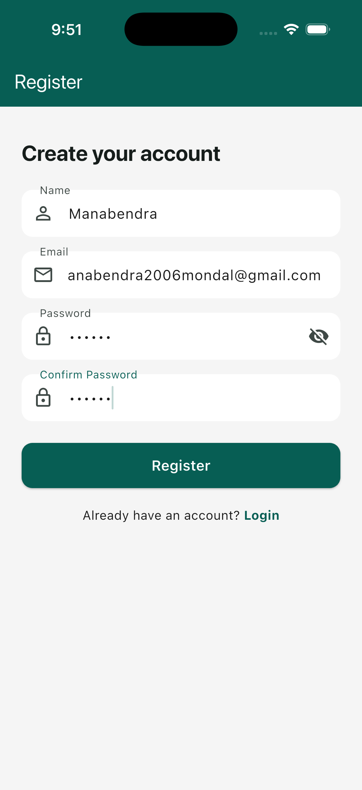 | 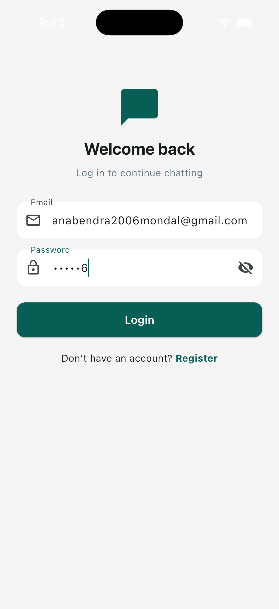 | 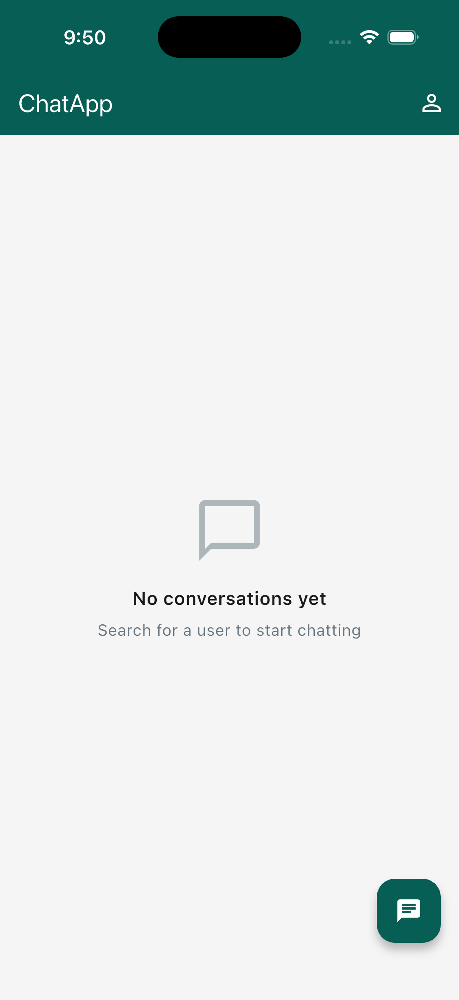 |
| *User registration with validation* | *Email & password sign-in* | *Clean initial landing empty state* |

---

### 💬 Messaging & User Discovery

| User Search Screen | Active Chat Room | Active Chat List |
| :---: | :---: | :---: |
| 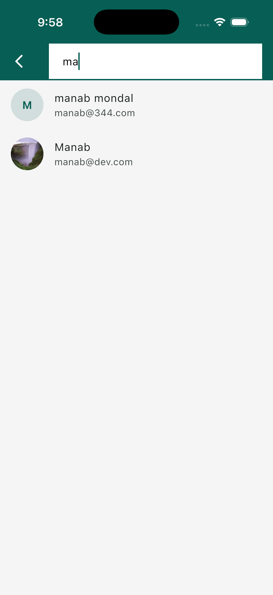 | 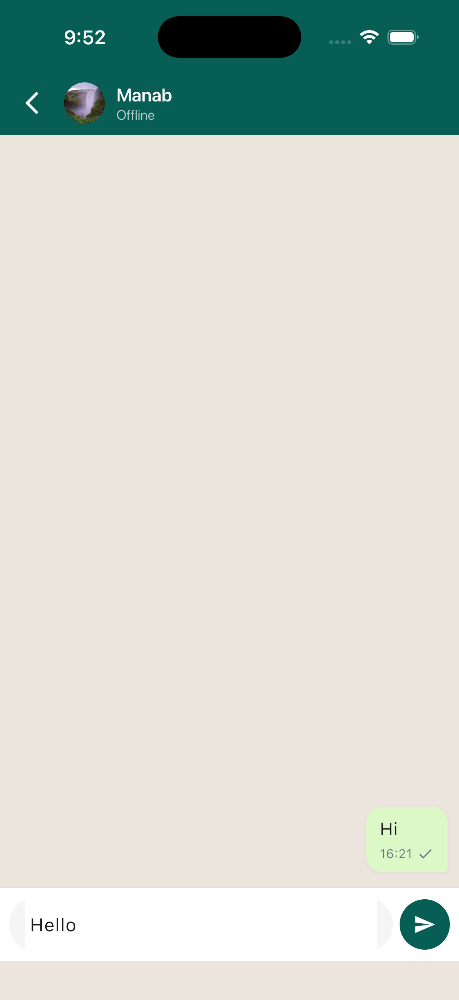 | 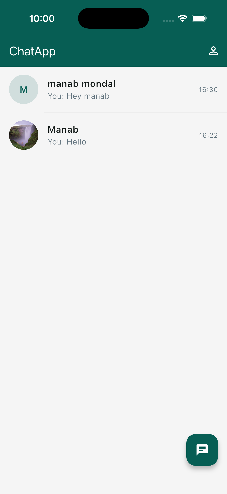 |
| *Debounced user search by name/email* | *1-on-1 chat with status & bubbles* | *Recent chats with unread & preview* |

---

### 👤 Profile & Settings

| Profile View | Photo Attachment Picker | Updated Avatar Profile |
| :---: | :---: | :---: |
| 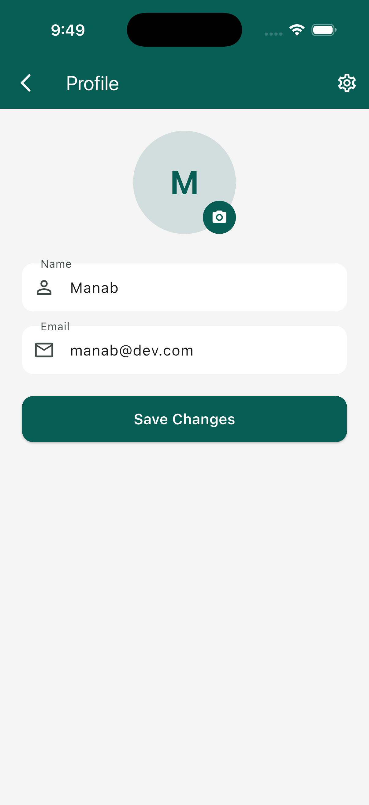 | 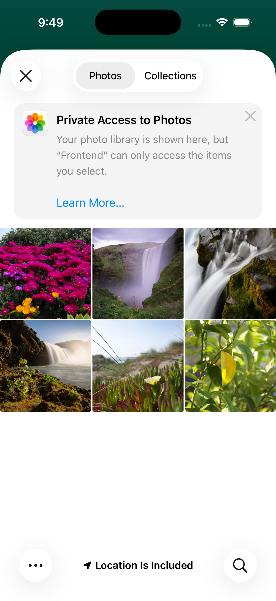 | 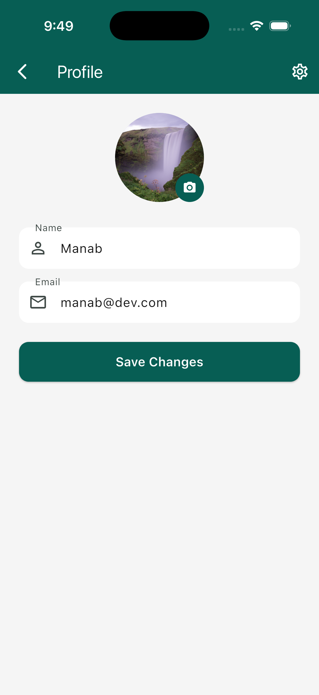 |
| *View and edit account information* | *Native photo gallery picker* | *Live avatar image update* |

---

### ⚙️ Preferences & Live Multi-Device Synchronization

| Settings Screen | Logout Confirmation | Cross-Platform Live Sync |
| :---: | :---: | :---: |
| 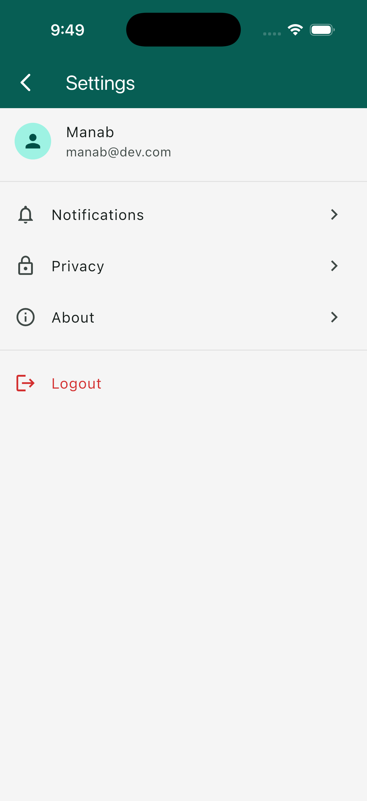 | 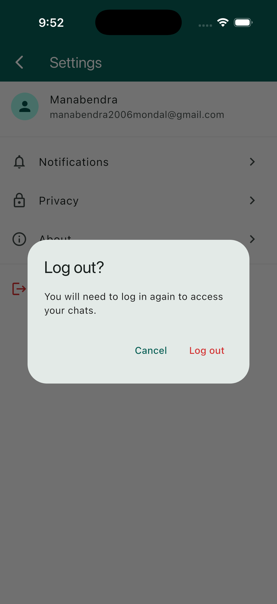 | 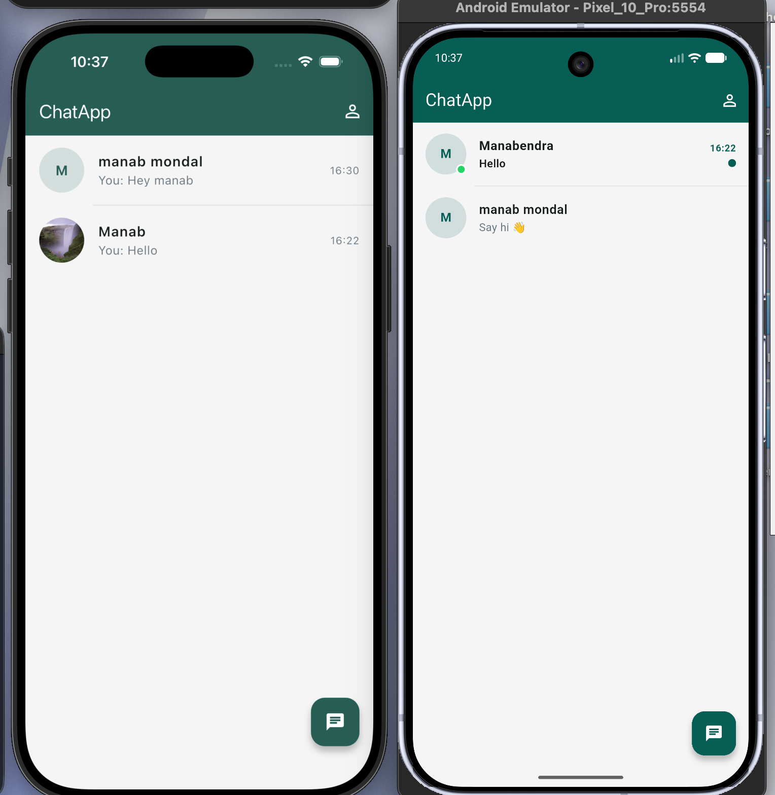 |
| *Account & app preferences* | *Secure session sign-out dialog* | *Real-time sync on iOS & Android* |

---

## 🗄️ Database & Terminal

The backend utilizes **MongoDB** via **Mongoose** with optimized indexes on lookup fields, timestamps, and relational ObjectIds.

<p align="center">
  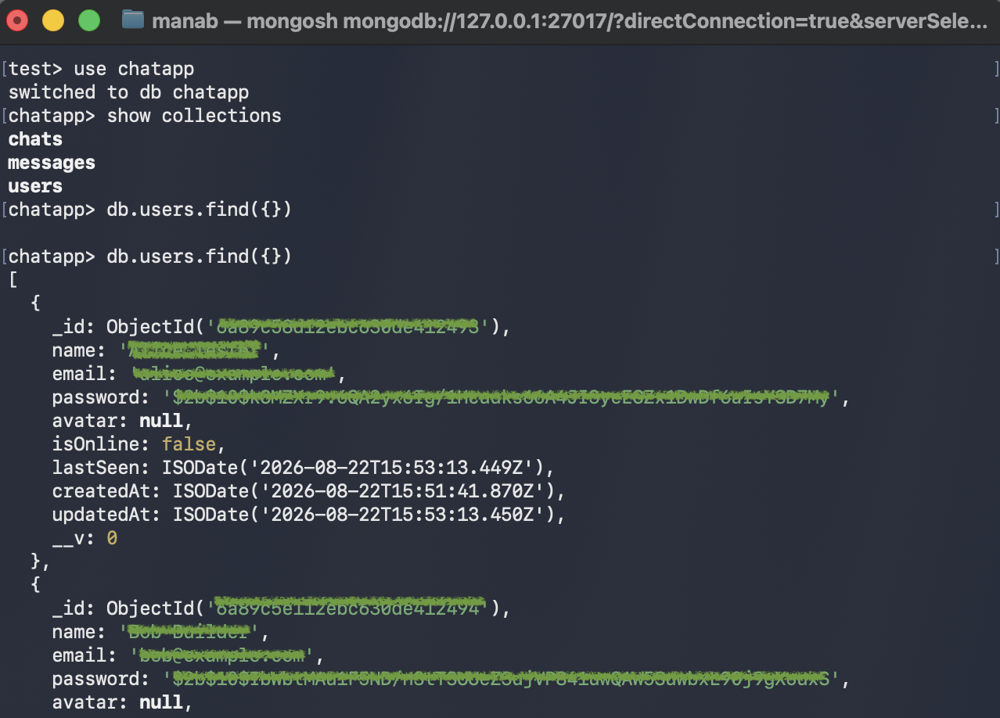
</p>
<p align="center">
  <em>MongoDB <code>mongosh</code> session displaying active database <code>chatapp</code>, collections (<code>chats</code>, <code>messages</code>, <code>users</code>), and indexed documents.</em>
</p>

### Database Architecture & Collections

| Collection | Model File | Purpose & Stored Attributes | Indexes |
| :--- | :--- | :--- | :--- |
| **`users`** | [`User.js`](backend/src/models/User.js) | Stores user profiles: `name`, `email` (unique, lowercase), `password` (bcrypt hash, `select: false`), `avatar` URL, `isOnline` boolean, `lastSeen` date, `createdAt`, `updatedAt`. | Unique index on `email`, Compound text index on `{ name: "text", email: "text" }`. |
| **`chats`** | [`Chat.js`](backend/src/models/Chat.js) | Stores 1-on-1 conversation records: `participants` (Array of 2 User ObjectIds), `lastMessage` (Message ObjectId reference), `lastMessageAt` date, `createdAt`, `updatedAt`. | Index on `participants`, Descending index on `updatedAt`. |
| **`messages`** | [`Message.js`](backend/src/models/Message.js) | Stores individual chat messages: `chatId` (Chat reference), `sender` (User reference), `receiver` (User reference), `message` text, `messageType` (`text`, `image`, `file`, `emoji`), `fileUrl`, `fileName`, `fileSize`, `isRead`, `readAt`, `delivered`, `deliveredAt`. | Compound index on `{ chatId: 1, createdAt: -1 }`, `{ sender: 1, receiver: 1 }`, `{ isRead: 1 }`, `{ delivered: 1 }`. |

### Database Connection Lifecycle
- Connected via Mongoose in [`backend/src/config/database.js`](backend/src/config/database.js) using the `MONGO_URI` environment variable.
- Connection state is monitored and exposed via the `/health` diagnostic endpoint (`mongodb: connected`).

---

## 🏛️ System Architecture

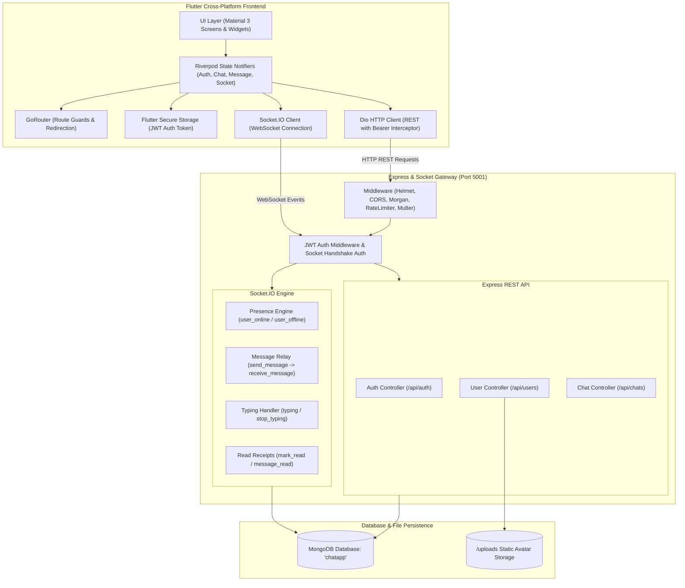

---

## 🔄 Application & Data Flows

### 1. Authentication & Route Guard Flow

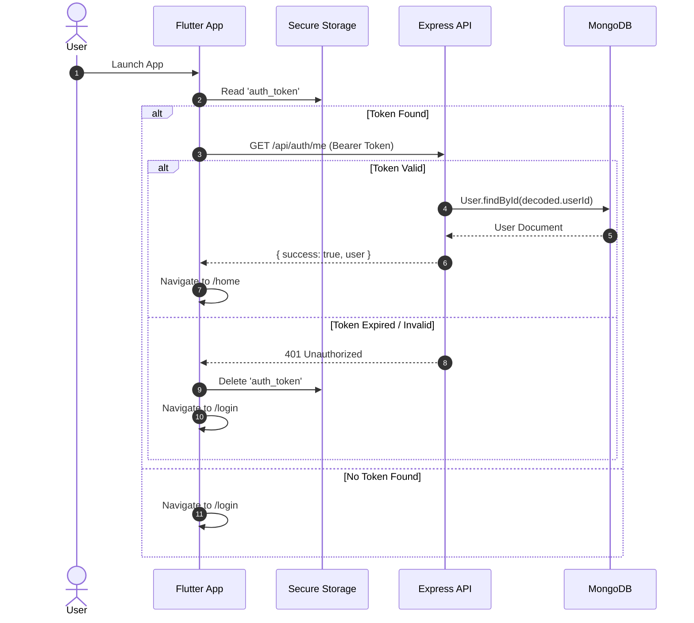

### 2. Real-Time Messaging & Presence Flow

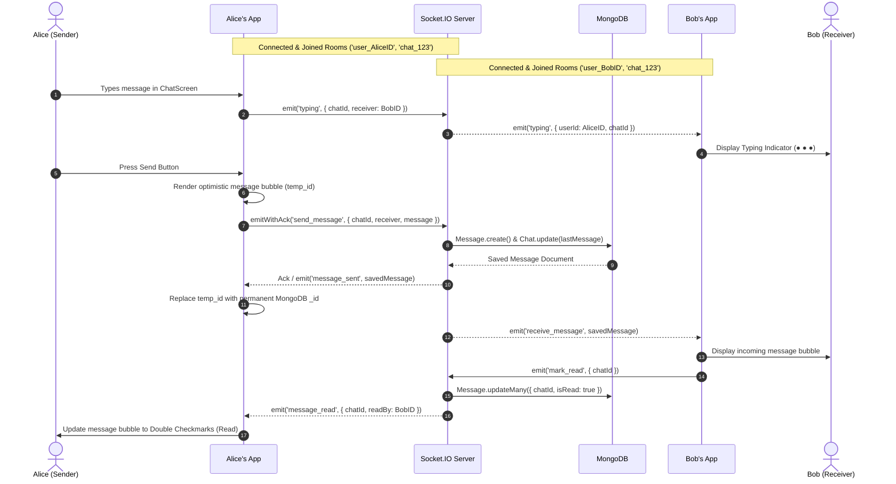

---

## 📂 Frontend Structure

```text
frontend/
├── assets/
│   └── logo.png                             # App icon and branding asset
├── lib/
│   ├── main.dart                            # Application entry point, dotenv initialization & ProviderScope
│   ├── core/
│   │   ├── api/
│   │   │   ├── api_client.dart              # Dio HTTP instance, auth interceptors & Android localhost rewriter
│   │   │   ├── api_endpoints.dart           # Centralized REST route constants
│   │   │   ├── environment.dart             # Environment config and fallback URLs
│   │   │   └── socket_client.dart           # Socket.IO client singleton abstraction
│   │   └── constants/
│   │       ├── app_colors.dart              # Material 3 theme color palette
│   │       ├── app_strings.dart             # Localized UI string constants & storage keys
│   │       └── app_theme.dart               # ThemeData definition (AppBar, Buttons, Inputs)
│   ├── models/
│   │   ├── api_response.dart                # Generic API response wrapper model
│   │   ├── chat.dart                        # Chat room model & participant resolver
│   │   ├── message.dart                     # Message entity model & type parser (text/image/file/emoji)
│   │   └── user.dart                        # User entity model (Equatable)
│   ├── providers/
│   │   ├── auth_provider.dart               # AuthStateNotifier (login, register, auto-login, logout)
│   │   ├── chat_provider.dart               # ChatListNotifier (live chat list state & ordering)
│   │   ├── message_provider.dart            # ChatMessagesNotifier (chat room state, pagination, optimistic UI)
│   │   ├── socket_provider.dart             # SocketController & OnlineUsersNotifier (global presence)
│   │   └── user_provider.dart               # UserSearchNotifier & ProfileEditNotifier
│   ├── routes/
│   │   └── app_router.dart                  # GoRouter configuration with auth-state refresh listeners
│   ├── screens/
│   │   ├── chat/
│   │   │   ├── widgets/
│   │   │   │   ├── chat_input_field.dart    # Chat textfield with dynamic send button
│   │   │   │   ├── message_bubble.dart      # Chat bubble with timestamp and delivery status
│   │   │   │   ├── message_input.dart       # Auxiliary input components
│   │   │   │   └── typing_indicator.dart    # Animated pulsing typing indicator
│   │   │   └── chat_screen.dart             # 1-on-1 chat room with reverse pagination
│   │   ├── home/
│   │   │   ├── widgets/
│   │   │   │   └── chat_list_tile.dart      # Chat tile with avatar, last message preview & unread dot
│   │   │   └── home_screen.dart             # Recent conversations feed with search FAB
│   │   ├── login/
│   │   │   └── login_screen.dart            # Sign-in form with email/password validation
│   │   ├── profile/
│   │   │   └── profile_screen.dart          # Profile editing & avatar image picker upload
│   │   ├── register/
│   │   │   └── register_screen.dart         # Account registration form
│   │   ├── search/
│   │   │   └── user_search_screen.dart      # Live debounced user search & direct chat initiation
│   │   ├── settings/
│   │   │   └── settings_screen.dart         # Settings list & logout confirmation modal
│   │   └── splash/
│   │       └── splash_screen.dart           # Startup splash screen during auth verification
│   ├── services/
│   │   ├── auth_service.dart                # REST authentication endpoints service
│   │   ├── chat_service.dart                # REST chat creation & fetch service
│   │   ├── message_service.dart             # REST message pagination & fallback service
│   │   ├── socket_service.dart              # Low-level Socket.IO emitter and listener wrapper
│   │   ├── storage_service.dart             # FlutterSecureStorage wrapper for tokens
│   │   └── user_service.dart                # REST user search and avatar upload service
│   ├── utils/
│   │   ├── date_formatter.dart              # Time formatting for chat timestamps
│   │   └── validators.dart                  # Form validation logic (Email, Password, Name)
│   └── widgets/
│       ├── custom_button.dart               # Reusable primary action button with loading spinner
│       ├── custom_text_field.dart           # Reusable styled text input with prefix/suffix icons
│       ├── empty_state.dart                 # Reusable placeholder illustration & caption widget
│       ├── error_widget.dart                # Reusable error display with retry callback
│       └── loading_indicator.dart           # Centered progress indicator
├── pubspec.yaml                             # Flutter project configuration and package dependencies
└── analysis_options.yaml                    # Dart analyzer and linting rules
```

---

## 📂 Backend Structure

```text
backend/
├── src/
│   ├── config/
│   │   ├── cors.js                          # Dynamic CORS origin validator & Socket.IO CORS rules
│   │   └── database.js                      # Mongoose connection initialization
│   ├── controllers/
│   │   ├── authController.js                # Register, login, getMe, logout handlers
│   │   ├── chatController.js                # Fetch chats, create chat, get messages, send message, mark read
│   │   └── userController.js                # Get users, search users, update profile, upload avatar
│   ├── middleware/
│   │   ├── auth.js                          # JWT verification middleware for protected routes
│   │   ├── errorHandler.js                  # Centralized JSON error responder with environment checks
│   │   ├── rateLimiter.js                   # Express-rate-limit configuration
│   │   └── upload.js                        # Multer diskStorage and image fileFilter configuration
│   ├── models/
│   │   ├── Chat.js                          # Mongoose schema for conversations
│   │   ├── Message.js                       # Mongoose schema for messages
│   │   └── User.js                          # Mongoose schema for users (with password hiding & index rules)
│   ├── routes/
│   │   ├── authRoutes.js                    # Route definitions for /api/auth
│   │   ├── chatRoutes.js                    # Route definitions for /api/chats
│   │   └── userRoutes.js                    # Route definitions for /api/users
│   ├── sockets/
│   │   ├── events.js                        # Socket message sending, typing broadcast & read handlers
│   │   └── index.js                         # Socket.IO connection lifecycle & auth middleware
│   ├── utils/
│   │   ├── bcrypt.js                        # Password hashing and comparison utilities
│   │   └── jwt.js                           # JWT signing and verification helpers
│   ├── validators/
│   │   ├── authValidator.js                 # Express-validator rules for registration & login
│   │   └── chatValidator.js                 # Express-validator rules for messages
│   ├── app.js                               # Express app configuration, route mounting & /health endpoint
│   └── server.js                            # HTTP server, Socket.IO binding & port listener
├── uploads/                                 # Static storage directory for uploaded user avatars
├── .env.example                             # Environment variable template
└── package.json                             # Node.js dependencies, scripts and package metadata
```

---

## 🛠️ Tech Stack

### Frontend
- **Framework**: [Flutter](https://flutter.dev/) (v3.x / Dart SDK ^3.12.2)
- **State Management**: [Riverpod](https://pub.dev/packages/flutter_riverpod) (`flutter_riverpod: ^3.4.2`)
- **Navigation & Routing**: [GoRouter](https://pub.dev/packages/go_router) (`go_router: ^17.4.0`)
- **HTTP Client**: [Dio](https://pub.dev/packages/dio) (`dio: ^5.11.0`)
- **WebSocket Client**: [Socket.IO Client](https://pub.dev/packages/socket_io_client) (`socket_io_client: ^3.1.6`)
- **Secure Storage**: [Flutter Secure Storage](https://pub.dev/packages/flutter_secure_storage) (`flutter_secure_storage: ^10.3.1`)
- **Image Caching & Media**: [Cached Network Image](https://pub.dev/packages/cached_network_image) (`cached_network_image: ^3.4.1`), [Image Picker](https://pub.dev/packages/image_picker) (`image_picker: ^1.2.3`), [File Picker](https://pub.dev/packages/file_picker) (`file_picker: ^8.1.6`)
- **Utilities**: [Equatable](https://pub.dev/packages/equatable) (`equatable: ^2.1.0`), [Intl](https://pub.dev/packages/intl) (`intl: ^0.20.3`), [Flutter DotEnv](https://pub.dev/packages/flutter_dotenv) (`flutter_dotenv: ^6.0.1`)

### Backend
- **Runtime Environment**: [Node.js](https://nodejs.org/) (v18+ / v20+ recommended)
- **Web Framework**: [Express.js](https://expressjs.com/) (`express: ^5.2.1`)
- **Real-Time Engine**: [Socket.IO](https://socket.io/) (`socket.io: ^4.8.3`)
- **Database ODM**: [Mongoose](https://mongoosejs.com/) (`mongoose: ^9.9.1`)
- **Authentication**: [JSON Web Tokens](https://jwt.io/) (`jsonwebtoken: ^9.0.3`) & [bcrypt](https://github.com/kelektiv/node.bcrypt.js) (`bcrypt: ^6.0.0`)
- **Security & Validation**: [Helmet](https://helmetjs.github.io/) (`helmet: ^8.3.0`), [CORS](https://github.com/expressjs/cors) (`cors: ^2.8.6`), [Express Rate Limit](https://github.com/express-rate-limit/express-rate-limit) (`express-rate-limit: ^8.6.1`), [Express Validator](https://express-validator.github.io/) (`express-validator: ^7.3.2`)
- **File Uploads**: [Multer](https://github.com/expressjs/multer) (`multer: ^2.2.0`)
- **Logging & Dev Tools**: [Morgan](https://github.com/expressjs/morgan) (`morgan: ^1.11.0`), [Nodemon](https://nodemon.io/) (`nodemon: ^3.1.14`), [Dotenv](https://github.com/motdotla/dotenv) (`dotenv: ^17.4.2`)

### Database
- **Database**: [MongoDB](https://www.mongodb.com/) (Local Community Server or MongoDB Atlas Cloud)

---

## ⚙️ Prerequisites

Before getting started, make sure you have the following installed on your development machine:

| Requirement | Minimum / Recommended Version | Verification Command |
| :--- | :--- | :--- |
| **Flutter SDK** | `>= 3.12.2` | `flutter --version` |
| **Dart SDK** | `>= 3.12.2` | `dart --version` |
| **Node.js** | `>= 18.0.0` (LTS Recommended) | `node --version` |
| **npm** | `>= 9.0.0` | `npm --version` |
| **MongoDB** | `>= 6.0` (Local or MongoDB Atlas) | `mongosh --version` |
| **Git** | `>= 2.30.0` | `git --version` |
| **Android Studio / Xcode** | Latest stable (for emulator & simulator testing) | `flutter doctor` |

Verify your Flutter environment by running:
```bash
flutter doctor
```

---

## 🚀 Installation & Setup

Follow these step-by-step instructions to set up and run the application locally.

### Step 1 — Clone the Repository

```bash
git clone https://github.com/manab-ghh/basic-chat-app.git
cd basic-chat-app
```

---

### Step 2 — Backend Configuration & Setup

1. Navigate to the `backend` directory:
   ```bash
   cd backend
   ```

2. Install the required Node.js dependencies:
   ```bash
   npm install
   ```

3. Create your `.env` configuration file from the provided example template:
   ```bash
   cp .env.example .env
   ```

4. Open `.env` and verify the settings (see [Environment Variables](#-environment-variables) for details).

5. Start the backend development server:
   ```bash
   npm run dev
   ```
   *The server will start on port `5001` (or your configured `PORT`) and connect to MongoDB.*

---

### Step 3 — Frontend Configuration & Setup

1. Open a new terminal window and navigate to the `frontend` directory:
   ```bash
   cd frontend
   ```

2. Install Flutter package dependencies:
   ```bash
   flutter pub get
   ```

3. Ensure a `.env` file exists in the `frontend/` directory (or create one):
   ```bash
   cat <<EOF > .env
   BASE_URL=http://localhost:5001/api
   SOCKET_URL=http://localhost:5001
   EOF
   ```

   > [!TIP]
   > **Android Emulator Support**: The frontend codebase automatically rewrites `localhost` and `127.0.0.1` to `10.0.2.2` when running on Android emulators, so you do not need to manually change the URL.

4. Launch the Flutter application:
   ```bash
   # Run on the default connected device / simulator
   flutter run

   # Or run explicitly on Android / iOS / Chrome
   flutter run -d chrome
   flutter run -d ios
   flutter run -d android
   ```

---

## 🔐 Environment Variables

### Backend Configuration (`backend/.env`)

| Variable | Required | Default / Example | Purpose |
| :--- | :---: | :--- | :--- |
| `PORT` | No | `5001` | The HTTP & WebSocket server port. |
| `NODE_ENV` | No | `development` | Environment mode (`development` or `production`). |
| `MONGO_URI` | **Yes** | `mongodb://localhost:27017/chatapp` | MongoDB connection URI string (Local or Atlas). |
| `JWT_SECRET` | **Yes** | `your_super_secret_jwt_key_here` | Secret key used to sign and verify JWT authentication tokens. |
| `JWT_EXPIRES_IN` | No | `7d` | Lifespan of generated JWT tokens. |
| `CLIENT_URL` | No | `http://localhost:3000` | Allowed client origins for CORS validation. |
| `MAX_FILE_SIZE` | No | `5242880` | Maximum file upload size in bytes (5 MB). |
| `UPLOAD_DIR` | No | `uploads/` | Destination folder for uploaded avatar files. |
| `RATE_LIMIT_WINDOW`| No | `15` | Rate limiting window duration in minutes. |
| `RATE_LIMIT_MAX` | No | `100` | Maximum requests allowed per IP per time window. |

### Frontend Configuration (`frontend/.env`)

| Variable | Required | Default / Example | Purpose |
| :--- | :---: | :--- | :--- |
| `BASE_URL` | **Yes** | `http://localhost:5001/api` | Base URL for REST API calls. |
| `SOCKET_URL` | **Yes** | `http://localhost:5001` | Server URL for Socket.IO WebSocket connections. |

---

## 🍃 MongoDB Setup

You can run MongoDB locally or use MongoDB Atlas in the cloud.

### Option A: Local MongoDB
1. Start your local MongoDB server:
   ```bash
   # macOS (Homebrew)
   brew services start mongodb-community

   # Linux (systemd)
   sudo systemctl start mongod

   # Windows
   net start MongoDB
   ```
2. Verify connection via `mongosh`:
   ```bash
   mongosh
   ```
3. Set your `MONGO_URI` in `backend/.env`:
   ```env
   MONGO_URI=mongodb://localhost:27017/chatapp
   ```

### Option B: MongoDB Atlas (Cloud)
1. Log in to [MongoDB Atlas](https://www.mongodb.com/cloud/atlas) and create a free Shared Cluster.
2. Under **Database Access**, create a database user with password authentication.
3. Under **Network Access**, add `0.0.0.0/0` (or your specific IP) to the IP Access List.
4. Click **Connect** > **Drivers** (Node.js) to obtain your connection URI.
5. Set the URI in `backend/.env`:
   ```env
   MONGO_URI=mongodb+srv://<username>:<password>@<cluster-url>/chatapp?retryWrites=true&w=majority
   ```

---

## 🔑 Authentication

The application uses JSON Web Tokens (JWT) for secure, stateless authentication.

1. **Registration (`POST /api/auth/register`)**: Validates email uniqueness and formats, hashes password with `bcrypt`, creates user, and returns user profile with JWT.
2. **Login (`POST /api/auth/login`)**: Validates credentials against hashed password, updates `lastSeen`, and issues a new JWT.
3. **Token Storage**: Flutter saves the token securely via `FlutterSecureStorage` under the key `auth_token`.
4. **REST Authorization**: The `ApiClient` Dio interceptor automatically attaches the header `Authorization: Bearer <token>` to all protected endpoints.
5. **Socket Authorization**: The `SocketService` supplies the token in the socket connection handshake:
   ```javascript
   socket = io(socketUrl, {
     auth: { token: token },
     transports: ['websocket']
   });
   ```
6. **Token Verification**: Backend middleware [`auth.js`](backend/src/middleware/auth.js) verifies the token signature and attaches the active `User` document to `req.user`.

---

## 🔌 API Endpoints

### 🛡️ Authentication Endpoints (`/api/auth`)

| Method | Endpoint | Auth Required | Description |
| :--- | :--- | :---: | :--- |
| `POST` | `/api/auth/register` | No | Register a new user account. |
| `POST` | `/api/auth/login` | No | Authenticate user and obtain a JWT token. |
| `GET` | `/api/auth/me` | **Yes** | Retrieve authenticated user's profile. |
| `POST` | `/api/auth/logout` | **Yes** | Logout user session. |

#### Example: Register User
```http
POST /api/auth/register
Content-Type: application/json

{
  "name": "Manabendra Mondal",
  "email": "manab@dev.com",
  "password": "securepassword123"
}
```
**Response (`201 Created`):**
```json
{
  "success": true,
  "message": "User registered successfully",
  "data": {
    "user": {
      "id": "66c75a1b2e1f3a001a123456",
      "name": "Manabendra Mondal",
      "email": "manab@dev.com",
      "avatar": null,
      "isOnline": false,
      "lastSeen": "2026-08-23T10:00:00.000Z",
      "createdAt": "2026-08-23T10:00:00.000Z",
      "updatedAt": "2026-08-23T10:00:00.000Z"
    },
    "token": "eyJhbGciOiJIUzI1NiIsInR5cCI6IkpXVCJ9..."
  }
}
```

---

### 👥 User Endpoints (`/api/users`)

| Method | Endpoint | Auth Required | Description |
| :--- | :--- | :---: | :--- |
| `GET` | `/api/users` | **Yes** | Get all registered users (excluding current user). |
| `GET` | `/api/users/search?q=:query` | **Yes** | Search users by name or email (min 2 chars). |
| `PUT` | `/api/users/profile` | **Yes** | Update name or avatar URL. |
| `POST` | `/api/users/avatar` | **Yes** | Upload an avatar image file (`multipart/form-data`). |

---

### 💬 Chat & Message Endpoints (`/api/chats`)

| Method | Endpoint | Auth Required | Description |
| :--- | :--- | :---: | :--- |
| `GET` | `/api/chats` | **Yes** | Get all active conversation threads for current user. |
| `POST` | `/api/chats` | **Yes** | Get existing chat or create new chat with `userId`. |
| `GET` | `/api/chats/:chatId/messages` | **Yes** | Get paginated message history (`?page=1&limit=20`). |
| `POST` | `/api/chats/messages` | **Yes** | Send message via REST fallback. |
| `PUT` | `/api/chats/:chatId/read` | **Yes** | Mark all unread messages in chat as read. |

---

### ⚡ Socket.IO Real-Time Events

#### Client → Server Events
- `join_room`: `{ "chatId": "string" }` — Join a specific chat room.
- `leave_room`: `{ "chatId": "string" }` — Leave a chat room.
- `send_message`: `{ "chatId": "string", "receiver": "string", "message": "string", "messageType": "text" }` — Send real-time message.
- `typing`: `{ "chatId": "string", "receiver": "string" }` — Broadcast typing indicator.
- `stop_typing`: `{ "chatId": "string", "receiver": "string" }` — Clear typing indicator.
- `mark_read`: `{ "chatId": "string" }` — Mark received messages as read.
- `check_online_status`: `{ "targetUserId": "string" }` — Request presence status for a user.

#### Server → Client Events
- `receive_message`: Emitted to recipient room (`user_<receiverId>`) and chat room with the new message payload.
- `message_sent`: Emitted back to sender with confirmed message payload.
- `user_online`: Broadcast when a user connects (`{ "userId": "string", "isOnline": true }`).
- `user_offline`: Broadcast when a user disconnects (`{ "userId": "string", "isOnline": false, "lastSeen": Date }`).
- `typing` / `stop_typing`: Forwarded to the recipient user.
- `message_read` / `messages_read`: Emitted to chat room when messages are read.
- `online_status`: Responded to `check_online_status`.

---

## ▶️ Running the Application

### 1. Terminal 1 — Backend Server
```bash
cd backend
npm run dev
```

### 2. Terminal 2 — Flutter Frontend
```bash
cd frontend
flutter run
```

### Recommended Execution Order
1. **Ensure MongoDB is running** (Local service or Atlas cluster reachable).
2. **Start Backend** on port `5001` (`npm run dev`).
3. **Launch Frontend** via Flutter (`flutter run`).
4. **Register two accounts** (e.g. across two simulators/browsers) and start real-time messaging!

---

## ✅ Ready-to-Use Checklist

- [x] Clone the repository
- [x] Node.js and Flutter SDK prerequisites verified
- [x] MongoDB database started and accessible
- [x] `backend/.env` configured with `MONGO_URI` and `JWT_SECRET`
- [x] Backend dependencies installed (`npm install`)
- [x] Backend server running on `http://localhost:5001`
- [x] Frontend dependencies installed (`flutter pub get`)
- [x] Frontend `.env` configured with `BASE_URL` and `SOCKET_URL`
- [x] User registration & login verified
- [x] Real-time messaging, typing indicators, and presence verified

---

## 🐛 Troubleshooting

### 1. MongoDB Connection Failed (`ECONNREFUSED`)
- **Cause**: Local MongoDB daemon is not running, or Atlas IP whitelist does not permit connection.
- **Solution**:
  - For local: Start MongoDB with `brew services start mongodb-community` or `sudo systemctl start mongod`.
  - For Atlas: Add `0.0.0.0/0` under Network Access in MongoDB Atlas console.

### 2. Port Already in Use (`EADDRINUSE: 5001`)
- **Cause**: A background Node process is already using port `5001`.
- **Solution**: Terminate the existing process or change `PORT` in `.env`:
  ```bash
  lsof -ti :5001 | xargs kill -9
  ```

### 3. Android Emulator Cannot Reach Backend
- **Cause**: Android emulators refer to their own host loopback when using `localhost`.
- **Solution**: The app includes built-in rewriting (`10.0.2.2`), but ensure `backend/.env` allows CORS from local origins.

### 4. CORS Error on Web Browser
- **Cause**: Browser requests blocked by CORS headers.
- **Solution**: Add your web origin URL to `CLIENT_URL` in `backend/.env` (e.g. `CLIENT_URL=http://localhost:3000,http://localhost:8080`).

---

## 🔒 Security Best Practices

- **Never Commit Secrets**: Ensure `.env` is listed in `.gitignore` and never committed to public repositories.
- **Strong JWT Secrets**: Generate cryptographically secure keys (e.g. `openssl rand -base64 32`) for `JWT_SECRET`.
- **Bcrypt Salt Hashing**: All user passwords are salted and hashed with `bcrypt` prior to database persistence.
- **Sanitized JSON Output**: User Mongoose schema strips `password` and `__v` from all JSON responses.
- **Rate Limiting**: Protected API routes use `express-rate-limit` to mitigate brute-force and DoS attempts.
- **HTTPS & WSS in Production**: Always enable SSL/TLS termination in production environments.

---

## 🗺️ Roadmap & Future Enhancements

- [ ] **Group Chats**: Create group conversations with multiple participants and admin management.
- [ ] **Push Notifications**: Firebase Cloud Messaging (FCM) integration for background message delivery.
- [ ] **Media & Audio Messages**: Voice notes, audio recording, and full document file sharing.
- [ ] **Message Reactions**: Quick emoji reactions on individual message bubbles.
- [ ] **End-to-End Encryption (E2EE)**: Signal Protocol integration for zero-knowledge end-to-end encryption.
- [ ] **Dark Mode Theme**: Dynamic theme switching (Light / Dark mode).
- [ ] **Message Deletion & Editing**: "Delete for everyone" and message edit history.

---

## 📂 GitHub Repository Structure

```text
basic-chat-app/
├── app-screens/                             # Application screenshots and terminal previews
│   ├── database.png                         # MongoDB mongosh collections preview
│   ├── screen01.png                         # Register screen
│   ├── screen02.png                         # Login screen
│   ├── screen03.png                         # Empty chats screen
│   ├── screen04.png                         # Profile screen
│   ├── screen05.png                         # Settings screen
│   ├── screen06.png                         # Logout dialog
│   ├── screen07.png                         # User search screen
│   ├── screen08.png                         # 1-on-1 chat room screen
│   ├── screen09.png                         # Active chat list screen
│   ├── screen10.png                         # Photo picker interface
│   ├── screen11.png                         # Profile avatar updated
│   └── screen12.png                         # Dual device live cross-platform sync
├── backend/                                 # Node.js + Express + Socket.IO backend
│   ├── src/                                 # Server source code (controllers, models, routes, sockets)
│   ├── uploads/                             # Avatar uploads directory
│   ├── .env.example                         # Backend environment variables template
│   └── package.json                         # Node dependencies & start scripts
├── frontend/                                # Flutter cross-platform mobile & web client
│   ├── assets/                              # App logos and images
│   ├── lib/                                 # Dart source code (screens, providers, services, models)
│   ├── pubspec.yaml                         # Flutter dependencies and asset registrations
│   └── analysis_options.yaml                # Linting configuration
├── .gitignore                               # Git ignore rules for Flutter, Node, and .env
└── README.md                                # Project documentation
```

---

## 📄 License

The backend package configuration specifies the **ISC License**. For repository-wide usage terms, refer to project settings or repository maintainers.

---

## 👨‍💻 Author

**Manabendra Mondal**
- GitHub: [@manab-ghh](https://github.com/manab-ghh)
- Email: [manabendra2006mondal@gmail.com](mailto:manabendra2006mondal@gmail.com)
- Repository: [https://github.com/manab-ghh/basic-chat-app](https://github.com/manab-ghh/basic-chat-app)

---

<p align="center">
  <sub>Built with ❤️ by Manabendra Mondal using Flutter & Node.js</sub>
</p>
